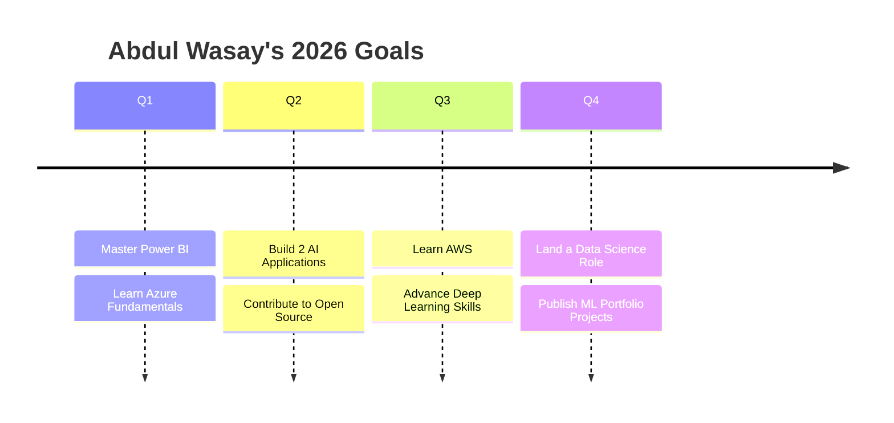

<div align="center">


<br/>


<a href="https://abdul-wasay-portfolio-one.vercel.app/"></a>
<a href="mailto:abdulwasaymalik757@gmail.com"></a>


<br/><br/>


</div>

<br/>

## 🧑‍💻 About Me


```yaml
name: Abdul Wasay
education: BS Computer Science Graduate
location: Wah Cantt, Punjab, Pakistan 🇵🇰
focus:
  - Data Science
  - Machine Learning
  - Full-Stack Development
currently_seeking: "Opportunities in Data Science & AI"
fun_fact: "I love transforming ideas into real-world software solutions"
motto: "The best way to predict the future is to create it."
```

- 🔭 Currently building **AI-powered** and **data-driven** platforms
- 🌱 Deep-diving into **Deep Learning**, **Power BI**, and **Azure Data Services**
- 👯 Looking to collaborate on **ML** and **Full-Stack** projects
- 💬 Ask me about **Python, React, Data Analytics, or ML pipelines**
- ⚡ Fun fact: I debug faster with coffee ☕ in hand

<br clear="both"/>


## 🌐 Connect With Me

<p align="center">
<a href="https://github.com/theabdulwasay"></a>
<a href="https://www.linkedin.com/in/abdul-wasay757"></a>
<a href="https://www.facebook.com/share/1HAZHQTpV5/"></a>
<a href="https://www.instagram.com/callme.wasayeee"></a>
<a href="mailto:abdulwasaymalik757@gmail.com"></a>
</p>


## 🚀 Tech Arsenal

<div align="center">

**💻 Languages**


**🌐 Frontend**


**⚙️ Backend**


**🗄️ Databases**


**🤖 Data Science & AI**


**🛠️ Tools & Platforms**


</div>

<br/>

### 📊 Proficiency

<div align="center">

| Skill | Level |
|---|---|
| 🐍 Python |  |
| ⚛️ React.js |  |
| 🤖 Machine Learning |  |
| 📊 SQL & Power BI |  |
| 🌐 Django / FastAPI |  |
| ☁️ Docker & Cloud |  |

</div>


## 🚀 Featured Projects

<table>
<tr>
<td width="50%" valign="top">

### 🚗 AutoFix
**Intelligent Multi-Branch Vehicle Service Hub**

AI-powered vehicle service management platform for multiple branches.

- 🤖 AI Maintenance Prediction
- 📅 Online Service Booking
- 📦 Inventory Management
- 📊 Analytics Dashboard
- 🔐 JWT Authentication
- 👨‍🔧 Admin & Staff Portal

`React` `Django REST` `FastAPI` `PostgreSQL` `Docker` `Python` `JWT`

</td>
<td width="50%" valign="top">

### 📊 StoreCast
**Retail Analytics & Inventory Forecasting Platform**

- 📈 Sales Analytics
- 🤖 ML Forecasting
- 📊 Business Dashboard
- 📦 Inventory Prediction
- 📉 Trend Analysis

`Python` `Pandas` `Scikit-learn` `React` `FastAPI`

</td>
</tr>
<tr>
<td width="50%" valign="top">

### 🏢 Smart Mini ERP
**Complete ERP Solution**

- 📦 Inventory
- 💳 POS
- 👥 CRM
- 💰 Finance
- 📊 Reports

`React` `Flask` `SQLite` `Chart.js`

</td>
<td width="50%" valign="top">

### 📋 TeamFlow
**Collaborative Task Manager**

- 📌 Kanban Boards
- 👨‍💻 Team Management
- 📅 Deadlines
- 📈 Productivity Dashboard

`React` `Node.js` `Express` `MongoDB`

</td>
</tr>
<tr>
<td width="50%" valign="top">

### 🛡️ CyberShield
**Cyber Security Analysis Platform**

- 🔑 Password Analyzer
- 🦠 Malware Scanner
- 🎣 Phishing Detector
- 🔌 Port Scanner
- 📧 Email Header Analyzer

</td>
<td width="50%" valign="top">

### 🌍 Wah Tour
**Tourism Platform for Wah Cantt**

- 🗺️ Interactive Maps
- 🍔 Restaurants
- 🏛️ Historical Places
- 🏨 Hotels
- 📸 Tourist Attractions

</td>
</tr>
</table>


## 📜 Certifications

<div align="center">

| Certification | Provider |
|---|---|
| 🏅 Python for Data Science | IBM |
| 🏅 Business Intelligence Professional Certificate | Google |
| 🏅 Web Scraping with Python | Duke University |
| 🏅 GenAI Data Analytics Job Simulation | Tata Group |
| 🏅 Introduction to Data Science | Cisco Networking Academy |
| 🏅 HTML Essentials | Cisco Networking Academy |
| 🏅 English for IT | Cisco Networking Academy |
| 🏅 Introduction to IoT | Cisco Networking Academy |

</div>


## 🌱 Currently Learning & Exploring

<p align="center">


</p>


## 🎯 2026 Roadmap




## 💼 Open to Opportunities

<p align="center">


</p>

<p align="center">
I'm always excited to collaborate on <b>Full-Stack Web Apps</b>, <b>Data Analytics Projects</b>, <b>AI & ML</b>, <b>Open Source</b>, <b>Hackathons</b>, and <b>Startup Ideas</b>. Let's build something great together!
</p>


## 📊 GitHub Analytics

<p align="center">


</p>

<p align="center">

</p>

<p align="center">

</p>

<p align="center">

</p>

### 🐍 Contribution Snake

<p align="center">

</p>

> 💡 The snake animation above animates itself automatically once you add the **[platane/snk](https://github.com/Platane/snk)** GitHub Action to this repo — it "eats" your contribution graph every day.

<details>
<summary>📈 More Coding Activity & Stats</summary>
<br/>
<p align="center">

</p>
<p align="center">


</p>
<p align="center">


</p>
</details>


## 💡 Favorite Quote

<div align="center">

> **"The best way to predict the future is to create it."**
> — *Peter Drucker*


</div>

<br/>

<div align="center">

### 🚀 Thanks for Visiting My Profile!

**⭐ If you like my work, consider following me and starring my repositories.**


*Made with ❤️ by **Abdul Wasay***


</div>
